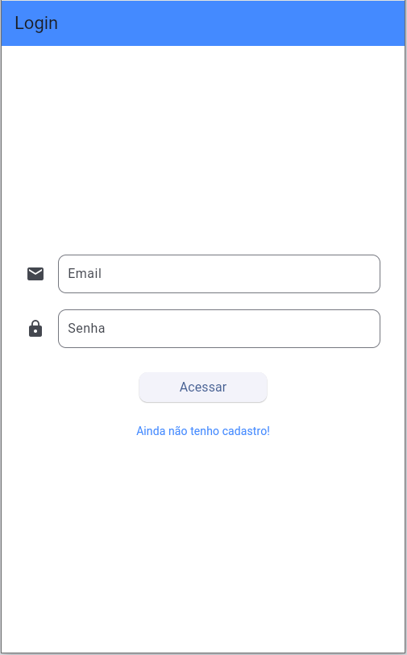
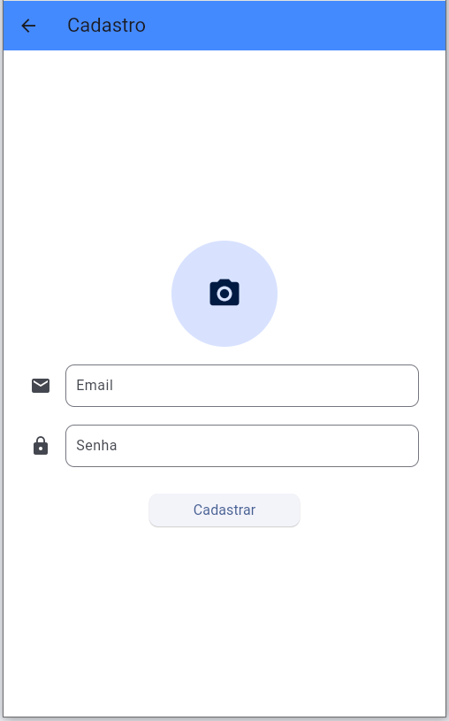
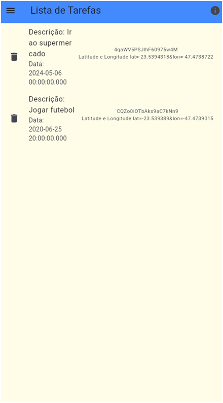
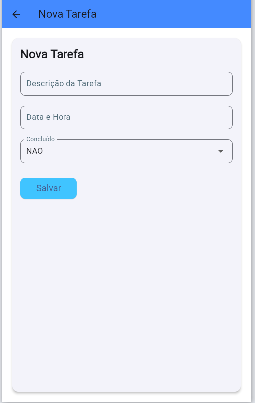
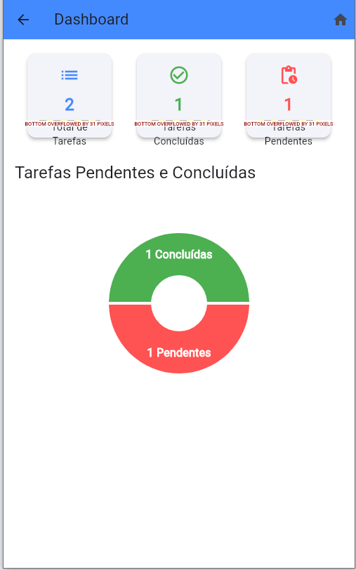
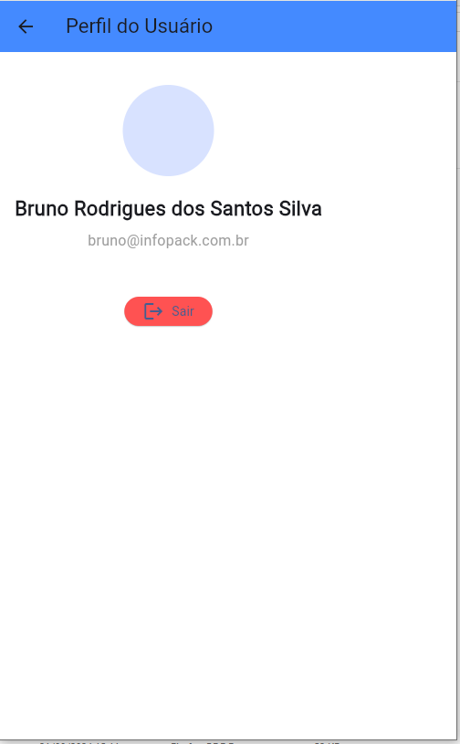

#Aluno:Bruno Rodrigues dos Santos Silva

Disciplina: UX-para-Desenvolvimento-Mobile-24E3_2

#Prints

TELA DE LOGIN (SIGIN)

TELA DE Cadastro

TELA DE MENU

TELA HOME

Nova Tarefa

Dashboard

PERFIL

